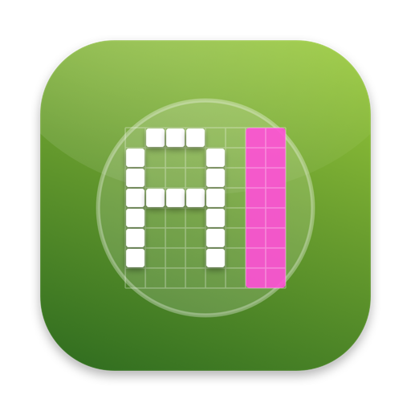
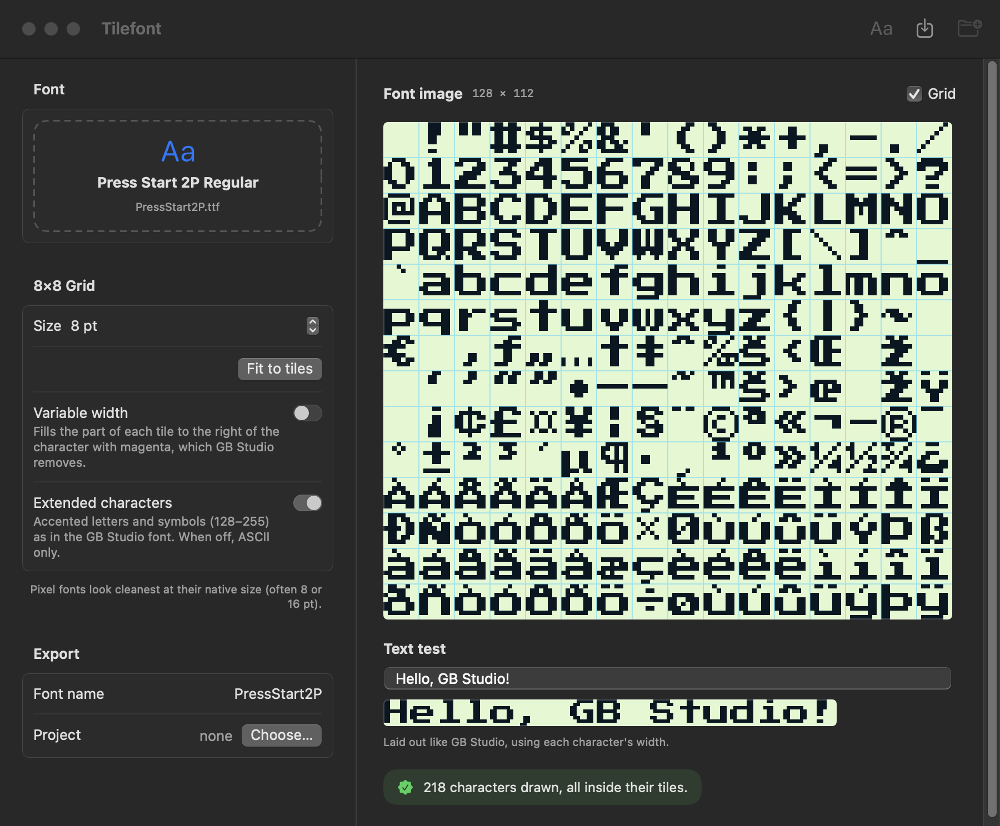

# Tilefont 🔠


**Tilefont** is a native macOS app that turns any TrueType or OpenType font into a font image ready for [GB Studio](https://www.gbstudio.dev): 128×112 pixels, 8×8 tiles, the same colours as GB Studio's own fonts, magenta variable-width markers and the `.json` file with the font name and character mapping.

<p align="center"></p>



## ✨ Features
- **GB Studio Layout:** 16×14 grid of 8×8 tiles, character 32 (space) in the top-left tile, ASCII 32–126 in order.
- **Extended Characters:** Tiles 128–255 with accented letters, € and symbols in the same order as GB Studio's built-in font (Latin-1 plus the Windows-1252 extras). Can be turned off for ASCII only.
- **Right Colours:** Background `#E0F8CF`, glyphs `#071821`, magenta `#FF00FF`, exactly like GB Studio's fonts. Pure white must be avoided: GB Studio treats it like magenta, so text would get a white box instead of a transparent background.
- **Font Metadata:** A `.json` file is saved next to every PNG with the font name shown in GB Studio and the mapping for characters 128–159 (€, „, …), which GB Studio would otherwise look up in the wrong tile.
- **Clean Pixels:** Glyphs are rendered in greyscale and kept where they cover at least 30% of a pixel, so thin strokes don't break apart at 7–8 px; the PNG holds only three colours. Pixel fonts at their native size come out pixel-identical.
- **Consistent Baseline:** One baseline for the whole font, taken from the ASCII characters; taller accented capitals are lowered just enough to keep their accents.
- **Variable Width:** The unused part of each tile is filled with magenta `#FF00FF`, leaving one empty column as letter spacing. Can be turned off for 8 px fixed-width fonts.
- **Fit to Tiles:** When a font is opened Tilefont picks the largest size where every character fits; the size can then be changed by hand.
- **Live Preview:** The font image at 4× with an optional 8×8 grid, and a text test laid out with each character's width, the way GB Studio shows it.
- **Clear Warnings:** Characters too tall or too wide for their tile and characters missing from the font are listed.
- **Add to Project:** Saves the PNG and its `.json` straight into the `assets/fonts` folder of a GB Studio project, asking before replacing a font with the same name. **Save Image…** saves them to any folder.
- **Font Files:** TTF, OTF and TTC/OTC (with a style picker); drop a font on the window or on the app icon, or use *Open With* in the Finder.
- **Appearance:** System, Light and Dark themes.
- **Multi-language:** Native support for Italian 🇮🇹 and English 🇬🇧 (system language or chosen in Settings).

## 🚀 Requirements
- macOS 14 (Sonoma) or later, Apple Silicon.

---

## 🍺 Installation via Homebrew (Recommended)

```bash
brew install --cask gionnio/tap/tilefont
```

### 🔄 Updating

```bash
brew upgrade --cask tilefont
```

---

## 📥 Manual Installation (Pre-built App)

1. Go to the **[Releases](../../releases)** section of this page.
2. Download the latest `.zip` file (e.g., `Tilefont_v1.0.0.zip`).
3. Unzip the file and move `Tilefont.app` to your **Applications** folder.

### ⚠️ How to open the app

Tilefont is not signed with a paid Apple Developer ID, so macOS may block the first launch with a security warning ("Apple could not verify…").

**To open it:**

1. Try to open `Tilefont` once and close the warning.
2. Open **System Settings → Privacy & Security**, scroll down and click **Open Anyway** next to the Tilefont message.
3. Confirm with **Open**. From then on it opens normally.

Right-click → Open no longer works for this on macOS 15 or later.

## 🛠 Build from Source

```bash
./build_app.sh            # build/Tilefont.app
./build_app.sh --install  # also installs it in /Applications and launches it
```

Requires the Xcode Command Line Tools (Swift 5.9+). During development: `cd app && swift run`. To work in Xcode, open `app/Package.swift`.

The icon is drawn by `icon/make_icon.swift`; the PNGs in `icon/AppIcon.iconset` are turned into `AppIcon.icns` by the build script.

## 🚧 Roadmap & TODO

* [x] **GB Studio font image:** 128×112, ASCII 32–126, variable width.
* [x] **Add to Project:** Save into `assets/fonts`.
* [x] **Extended characters:** Tiles 128–255 (accented letters, €, symbols) with the `.json` mapping.
* [x] **Homebrew Support:** Install and update via `brew install --cask gionnio/tap/tilefont`.
* [ ] **Glyph adjustments:** Manual X/Y offset and per-tile pixel editing.

## Privacy & Security

Everything runs locally on your Mac. Tilefont only reads the fonts you open and writes the PNG files you save; nothing is sent over the network.

Tilefont is an independent tool and is not affiliated with GB Studio.

## 🤖 AI Acknowledgment

This application was developed with the assistance of Artificial Intelligence for code generation, logic optimization, and problem-solving.

---

Created with AI, ❤️ and SwiftUI.
